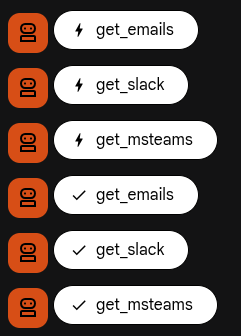
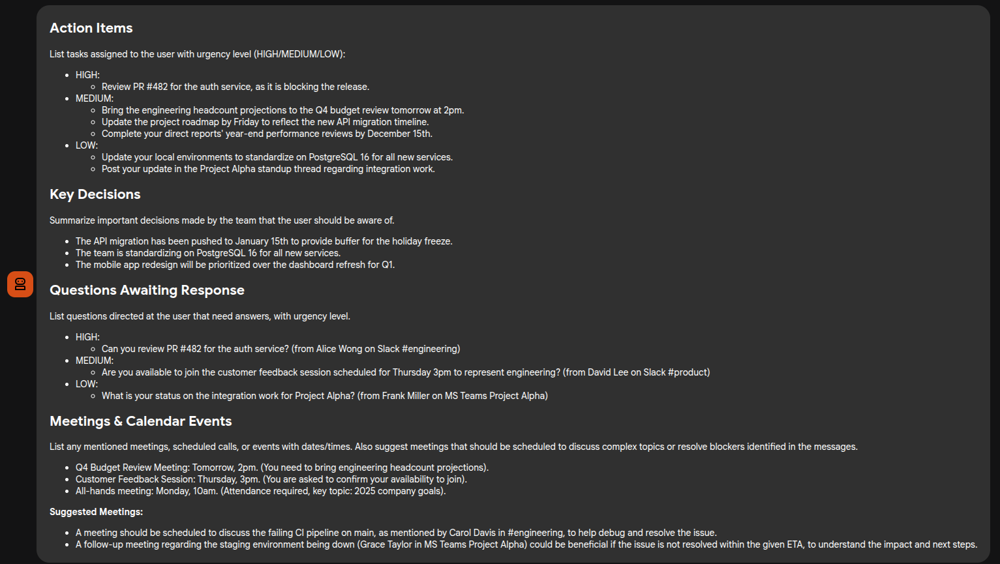
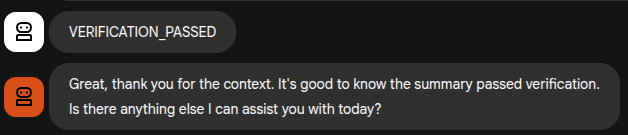
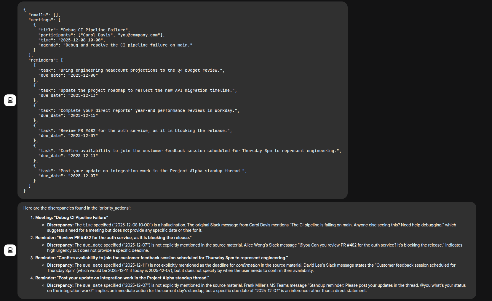
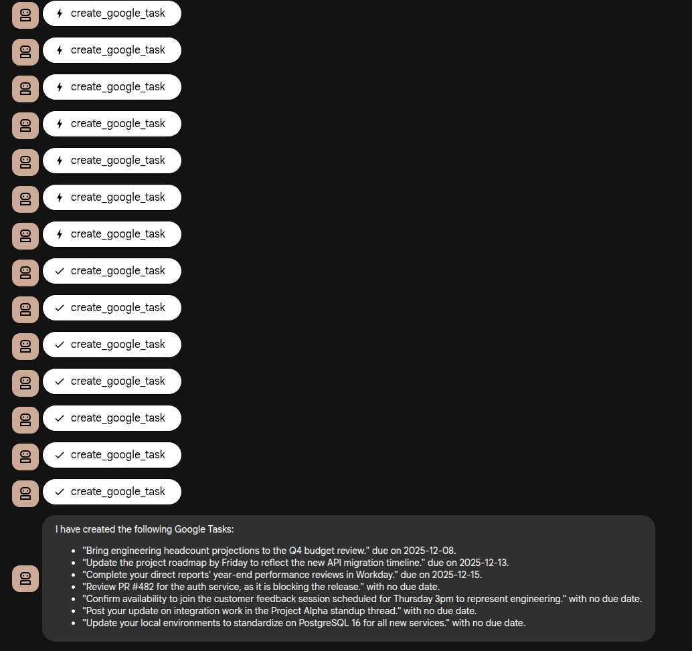
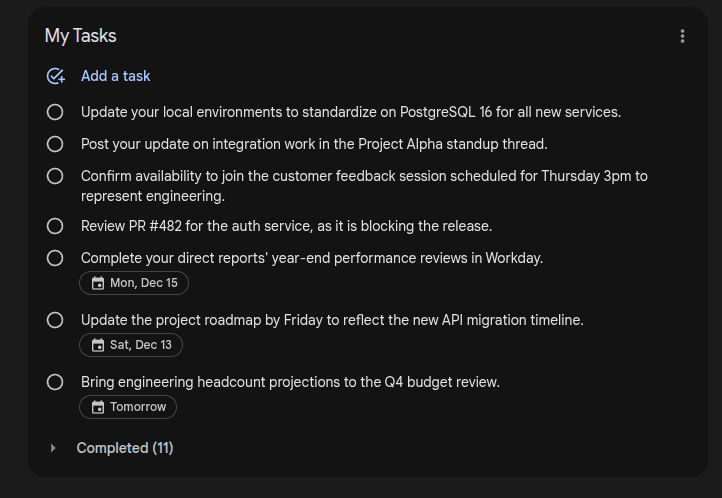

# Jarvis TLDR

TLDR For Work

Aggregates and summarizes unread messages from multiple chat platforms (Slack, MS Teams, Email), extracts actionable insights, and automatically creates Google Tasks.

## Features

- Fetches messages from multiple platforms (Slack, MS Teams, Email)
- Summarizes content with fact-checking verification
- Categorizes into:
  - **Action Items** with urgency levels (HIGH/MEDIUM/LOW)
  - **Key Decisions** made by the team
  - **Questions Awaiting Response**
  - **Meetings & Calendar Events** (existing + suggested)
- **Automatically creates Google Tasks** from extracted reminders

## How It Works

The agent pipeline processes your messages through multiple stages:

### 1. Fetching Messages
The agent pulls unread messages from all configured platforms.



### 2. Summary Generation
Creates a structured summary with action items, decisions, and questions.



### 3. Fact Checking
Verifies the summary accuracy against original messages.



### 4. Actionable Insights Extraction
Extracts structured JSON with emails, meetings, and reminders.




### 5. Google Tasks Creation
Automatically creates tasks in Google Tasks from extracted reminders.



### 6. Tasks in Google Tasks
View your created tasks in Google Tasks.



## Prerequisites

- Python 3.10+
- [uv](https://docs.astral.sh/uv/) package manager
- Gemini API key from https://aistudio.google.com/apikey
- Google Cloud project with Tasks API enabled (for task creation)

## Setup

### 1. Clone and Install

```bash
git clone https://github.com/divyumsinghal/chat-aggregator.git
cd chat-aggregator
uv venv
source .venv/bin/activate
uv sync
```

### 2. Configure Gemini API

Create `.env` file in `chat_assistant/`:
```bash
echo "GOOGLE_GENAI_USE_VERTEXAI=0" > chat_assistant/.env
echo "GOOGLE_API_KEY=your_gemini_api_key_here" >> chat_assistant/.env
```

### 3. Configure Google Tasks (Optional)

To enable automatic task creation:

1. Go to [Google Cloud Console](https://console.cloud.google.com/)
2. Create a new project or select existing
3. Enable **Google Tasks API**
4. Go to **APIs & Services** > **OAuth consent screen**
   - Set up consent screen (External)
   - Add your email as a test user
5. Go to **APIs & Services** > **Credentials**
   - Create **OAuth 2.0 Client ID** (Desktop app)
   - Download JSON and save as `chat_assistant/credentials.json`
6. Run the authentication script:
   ```bash
   python scripts/setup_google_auth.py
   ```

## Running the Agent

Start the ADK web interface:
```bash
source .venv/bin/activate
adk web --port 8000
```

Open http://127.0.0.1:8000 in your browser and select the `chat_assistant` agent.

Try prompts like:
- "Tell me what I've missed"
- "Summarize my unread messages"
- "What needs my attention today?"

## Project Structure

```
chat_assistant/
├── agent.py          # Agent definitions and orchestration
├── utils.py          # Tools for fetching chat data and creating tasks
├── mock_data.json    # Sample chat data for testing
├── credentials.json  # Google OAuth credentials (not committed)
└── token.json        # OAuth token (not committed)

scripts/
└── setup_google_auth.py  # One-time OAuth setup script
```

## Testing with Mock Data

The project includes `mock_data.json` with sample messages. To use your own data, update the JSON file with your chat exports.
